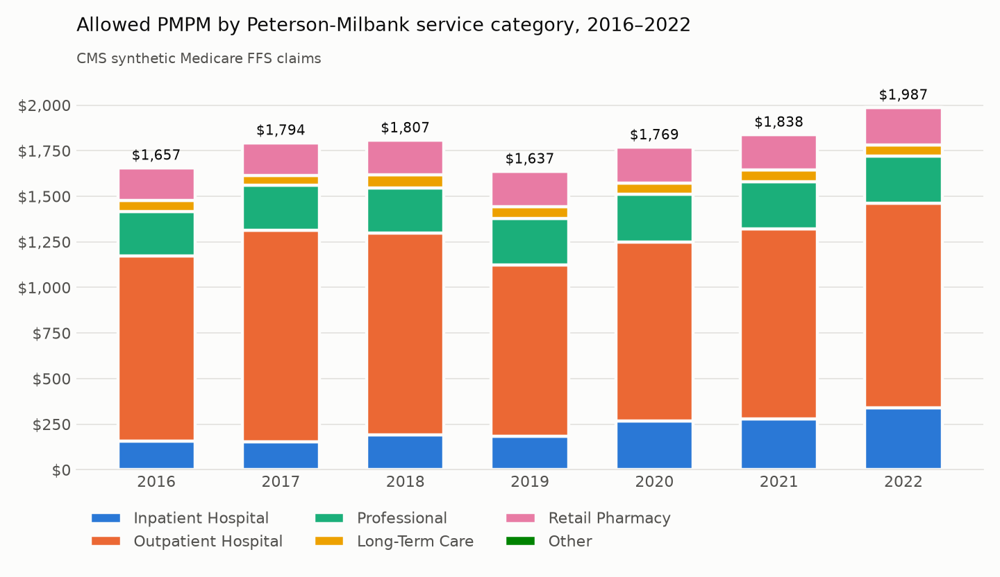
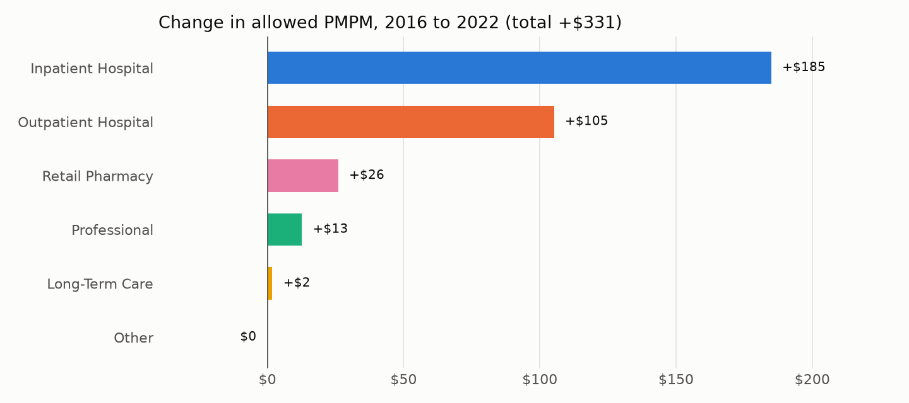

# Medicare Cost Drivers: Where Does the Money Go?

**Question:** In a Medicare fee-for-service population, how much is spent per member per month (PMPM), which
kinds of care drive that spending and its growth, and how much of it goes to primary care?

**Approach:** I applied the published Peterson-Milbank *consensus cost-driver specifications* (June 2025), the
standard that state cost growth target programs use, to CMS's public synthetic Medicare claims for 2016–2022.
The analysis is written in SQL. The results are shown in an interactive D3 dashboard and a Tableau workbook.

**Live:** [Case study](https://leorule.com/medicare-cost-drivers.html) ·
[D3 dashboard](https://leorule.com/medicare-cost-drivers-dashboard.html) ·
[Tableau Public](https://public.tableau.com/app/profile/leonard.rule/viz/MedicareCostDriversSyntehticFFSData/CostDrivers)

> **All data here is synthetic.** CMS generates these claims for testing and training, and none of them
> belong to real patients, providers or payments. Built only from public specifications and public data.

## What I found

| Year | Avg. members | Medical PMPM | Pharmacy PMPM | Total PMPM | Change | Primary care share |
|---|---|---|---|---|---|---|
| 2016 | 5,930 | $1,478 | $179 | $1,657 | | 1.94% |
| 2017 | 6,237 | $1,613 | $181 | $1,794 | +8.3% | 1.77% |
| 2018 | 6,599 | $1,616 | $191 | $1,807 | +0.7% | 1.78% |
| 2019 | 7,016 | $1,444 | $192 | $1,637 | −9.4% | 2.03% |
| 2020 | 7,386 | $1,573 | $196 | $1,769 | +8.1% | 1.84% |
| 2021 | 7,772 | $1,646 | $192 | $1,838 | +3.9% | 1.77% |
| 2022 | 8,175 | $1,782 | $205 | $1,987 | +8.1% | 1.73% |

1. **Spending per member rose $331 a month (+20%) from 2016 to 2022,** about 3.1% a year.
2. **Hospital stays got more expensive, not more common.** Inpatient care was 9% of 2016 spending but 56% of
   the increase (+$185 PMPM). Splitting that into volume and price: stays per 1,000 members rose 21%, while
   the allowed cost per stay rose 80% ($5,728 to $10,314). Higher cost per stay alone accounts for $139
   PMPM, 42% of all the growth. Outpatient added another $105.

   
3. **Primary care is under 2% of medical spending.** The synthetic file has no office visits, which are the
   core of the primary care definition, so what's counted is mostly care management after hospital
   discharge and screenings.
4. **Every reconciliation check passed.** Four checks are flagged as known gaps in the synthetic data rather
   than hidden (see [results/validation.csv](results/validation.csv)).

## The SQL
Full definitions and judgment calls are in
[METHODS.md](METHODS.md).

| File | What it does |
|---|---|
| `01_member_months.sql` | Turns each person's 12 monthly enrollment flags into one row per person per month, and keeps months with Part A and B in traditional Medicare. These member months are the denominator for every PMPM. |
| `02_claim_lines.sql` | Stacks the nine claim files (inpatient, outpatient, physician, SNF, home health, hospice, DME, Part D) into one table with the same columns and one dollar definition (allowed amount). |
| `03_service_categories.sql` | Puts every claim into one of six Milbank categories (inpatient, outpatient, professional, long-term care, retail pharmacy, other) and a subcategory, then keeps only claims that fall in a month the person was enrolled. |
| `04_pmpm.sql` | PMPM by category and year, year-over-year growth, annual growth rate, and the summary tables the dashboard uses. |
| `05_primary_care.sql` | The Milbank primary care definition, Steps 1–6: which service codes, provider specialties and places of service count as primary care. |
| `06_validation.sql` | 20+ checks that nothing was lost or double counted: row counts, dollar totals, eligibility match, and a rebuild of PMPM from the summary tables. |
| `07_dashboard_facts.sql` | Inpatient stays and dollars for the volume-vs-price split, and distinct member counts for every filter combination (`CUBE`). |

## The results
| File | One row per |
|---|---|
| `pmpm_total.csv` | year: medical, pharmacy and total PMPM, growth |
| `pmpm_by_category.csv` | year × service category: dollars, member months, PMPM |
| `pmpm_growth.csv` | year × service category: year-over-year change and growth rate since 2016 |
| `primary_care_by_year.csv` | year: primary care dollars, PMPM, share of medical and total spending |
| `primary_care_by_service.csv` | year × primary care service group |
| `member_months_by_year.csv` | year: member months, average members, % dual eligible |
| `spend_fact.csv`, `mm_fact.csv`, `pc_fact.csv` | detailed building blocks (by year, category and demographic group) that the dashboard adds up |
| `tableau_data.csv` | the three building-block tables stacked into one file for Tableau |
| `ip_fact.csv` | year × demographic group: inpatient stays and allowed dollars |
| `members_fact.csv` | year × every filter combination: distinct members |
| `validation.csv` | one row per quality check, with PASS or FLAG |

## Data and sources
- **Claims:** CMS Synthetic Medicare Enrollment, Fee-for-Service Claims and Prescription Drug Event data
  (data.cms.gov, 2023 release). 10,000 synthetic people. Study years 2016–2022.
- **Method:** Peterson-Milbank Program for Sustainable Health Care Costs, *Consensus Administrative
  Specifications for Health Care Cost Driver Analyses* and *Cost Growth Target* specifications (June 2025).

Leo Rule · [leorule.com](https://leorule.com)
